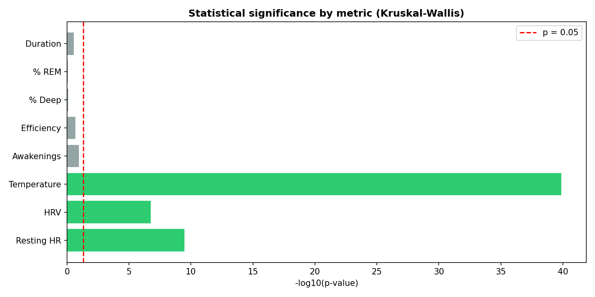
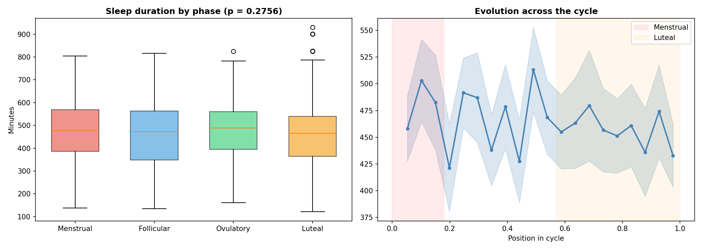
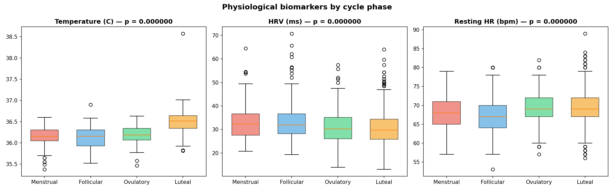
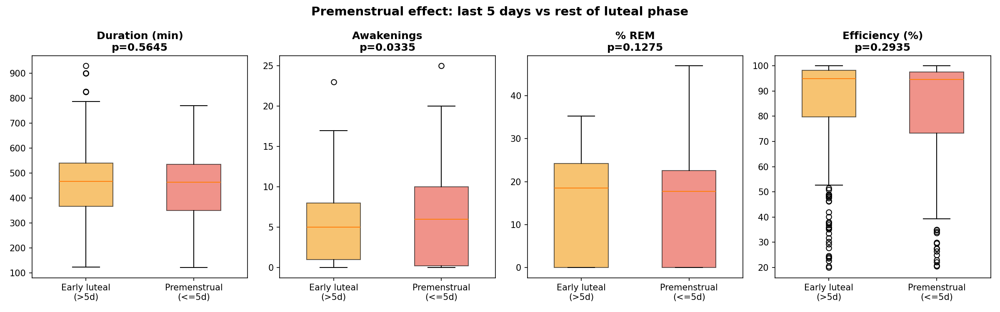
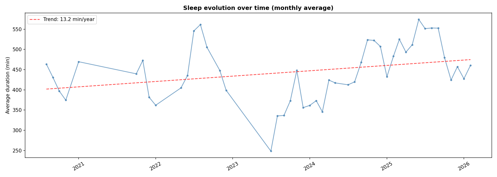

# redmoon

[](https://github.com/aroaxinping/redmoon/actions/workflows/ci.yml)
[](https://pypi.org/project/redmoon/)
[](https://pypi.org/project/redmoon/)
[](LICENSE)

Analysis tool that cross-references menstrual cycle data with sleep metrics, HRV and heart rate from your Apple Health export.

One line and you get a report with statistical tests, correlations and hormonal pattern detection in your sleep.

```bash
pip install redmoon
redmoon analyze export.xml
```

Don't have Apple Health data? The repo includes **synthetic sample data** so you can try everything without an iPhone:

```bash
git clone https://github.com/aroaxinping/redmoon.git
cd redmoon
pip install -e ".[all]"
pytest tests/ -v          # 48 tests
redmoon dashboard         # opens the dashboard with sample data
```

---

## Dashboard

<p align="center">

</p>

<p align="center">

</p>

<p align="center">

</p>

<p align="center">

</p>

<p align="center">

</p>

---

## What redmoon finds

Real results from ~6 years of Apple Health data (76 cycles, 1,153 nights):

| Metric | Changes with the cycle? | Detail |
|---|---|---|
| Wrist temperature | Yes (p < 0.000001) | +0.375 °C in luteal vs follicular phase |
| HRV | Yes (p < 0.000001) | -3ms in luteal phase |
| Resting heart rate | Yes (p < 0.000001) | +2bpm in luteal phase |
| Premenstrual awakenings | Yes (p = 0.034) | +1.1 awakenings/night in the last 5 days |
| Sleep duration | No (p = 0.28) | No difference between phases |
| % REM / % Deep | No (p > 0.7) | No difference between phases |
| Sleep efficiency | No (p = 0.21) | No difference between phases |

**Conclusion**: hormones change your nighttime physiology very clearly (temperature, HRV, heart rate), but sleep itself is only affected right before the period, with more awakenings.

How does this compare to published studies, and how reliable is the Apple Watch as an
instrument? Honest, finding-by-finding analysis in [RESEARCH.md](RESEARCH.md).

---

## How to use redmoon with your own data

### 1. Export Apple Health data

On your iPhone: Health → profile picture → Export Health Data → generates a zip with `export.xml`.

### 2. Install

```bash
pip install redmoon
```

With optional extras:

```bash
pip install redmoon[all]    # includes visualizations, ML and dashboard
pip install redmoon[viz]    # matplotlib + seaborn only
pip install redmoon[ml]     # scikit-learn only
```

### 3. Run the analysis

**From the terminal:**

```bash
# Full analysis with console report
redmoon analyze export.xml

# Save report to file + intermediate CSVs
redmoon analyze export.xml --output report.txt --csv-dir data/

# Export as JSON (for integrations or downstream processing)
redmoon analyze export.xml --json --output report.json

# Verbose mode for detailed logs
redmoon -v analyze export.xml
```

**As a Python library:**

```python
from redmoon import parse_export, CycleSleepAnalyzer

data = parse_export("export.xml")
analyzer = CycleSleepAnalyzer(data)
report = analyzer.run()

# Full text report
print(report.summary())

# Phase means as a DataFrame
report.phase_means()

# Statistical tests
report.statistical_tests()

# Premenstrual effect
report.premenstrual_effect()

# Export as a JSON-serializable dict
report.to_json()
```

### 4. Interactive dashboard (optional)

```bash
pip install redmoon[all]
redmoon dashboard
```

6 views: summary, sleep by phase, biomarkers, premenstrual effect, time trend, related research.

If you don't have your own data in `data/`, the dashboard automatically falls back to the synthetic data in `sample_data/`.

### 5. Analysis notebook (optional)

```bash
jupyter notebook notebooks/analysis.ipynb
```

16 sections with full visualizations, statistical tests, ML prediction, and correlations.

---

## What data you need

redmoon automatically extracts from the Apple Health XML export:

| Data | Source | Typical records |
|---|---|---|
| Sleep stages (Core, REM, Deep, Awake) | Apple Watch | Thousands |
| Menstrual flow | Health app / tracker | Hundreds |
| Nightly wrist temperature | Apple Watch Ultra / Series 8+ | Hundreds |
| HRV (SDNN) | Apple Watch | Thousands |
| Resting heart rate | Apple Watch | Thousands |
| Breathing disturbances | Apple Watch | Hundreds |

You don't need all of them. The minimum is **sleep + period**. Biomarkers (temperature, HRV, HR) enrich the analysis but are optional.

---

## Methodology

### Nightly aggregation

Each night is assigned to the date sleep started. If you fall asleep at 2:00 AM, that night counts as the previous day. Nights with <2h of sleep or >16h in bed are filtered out.

### Cycle detection

Consecutive bleeding days are grouped into periods. A new period starts when there are >5 days without bleeding. Cycles shorter than 21 or longer than 45 days are excluded.

### Phase assignment

Each cycle is split into 4 phases proportionally to its actual length:

| Phase | Typical days | What happens hormonally |
|---|---|---|
| **Menstrual** | 1-5 | Estrogen and progesterone at their lowest. Bleeding. Fatigue. |
| **Follicular** | 6-13 | Estrogen rises. More energy and mental clarity. |
| **Ovulatory** | 14-16 | Estrogen and LH peak. Egg release. Temperature starts rising. |
| **Luteal** | 17-28+ | High progesterone. Temperature +0.3-0.5 °C. Hormonal drop at the end → PMS. |

The luteal phase is split into **early luteal** and **premenstrual** (last 5 days) to isolate the PMS effect.

*Internally, the code stores these phases with their Spanish names (Menstrual, Folicular, Ovulatoria, Lútea) as the real grouping keys — only display labels are translated where relevant (e.g. in the dashboard's language switcher).*

### Statistical tests

- **Kruskal-Wallis**: non-parametric test to compare the 4 phases
- **Mann-Whitney U with Bonferroni correction**: pairwise post-hoc comparisons
- **Spearman**: correlations between metrics
- **Random Forest**: luteal vs non-luteal phase prediction (F1 = 0.73 with temperature + HRV + HR,
  validated with `StratifiedGroupKFold` grouping by cycle — see [RESEARCH.md](RESEARCH.md#5-phase-prediction-with-random-forest)
  for why the naive number was 0.79 and why that number was overly optimistic)

### Outlier cleaning

- **Efficiency > 100%**: Apple Health can log InBed from the iPhone and sleep stages from the Watch, causing inconsistencies. `max(InBed, sleep+awake)` is used as the denominator and capped at 100%.
- **Abnormal cycles**: <21 or >45 days are excluded.
- **Pre-2020 nights**: only have InBed with no stage breakdown (the Watch didn't support it yet).

---

## Project structure

```
redmoon/
├── redmoon/               # Python package (PyPI)
│   ├── __init__.py        #   Exports: parse_export, CycleSleepAnalyzer
│   ├── parser.py          #   XML → DataFrames
│   ├── analyzer.py        #   Analysis + report + JSON export
│   ├── constants.py       #   Constants, thresholds and phase logic
│   └── cli.py             #   CLI: redmoon analyze / redmoon dashboard
├── tests/                 # Tests (pytest, 49 tests)
│   ├── test_parser.py     #   Parser: types, columns, validation, edge cases
│   ├── test_analyzer.py   #   Analyzer: pipeline, report, JSON serialization
│   └── test_constants.py  #   Phase assignment, boundary cycles (21/45d)
├── sample_data/           # Synthetic data (3 cycles, ~85 nights)
├── notebooks/
│   └── analysis.ipynb     # Full analysis with charts
├── dashboard.py           # Streamlit dashboard (6 views)
├── .github/workflows/     # CI: tests on Python 3.9-3.12
├── data/                  # (gitignored) your private data
├── pyproject.toml
└── LICENSE                # MIT
```

## Local development

```bash
git clone https://github.com/aroaxinping/redmoon.git
cd redmoon
pip install -e ".[all]"
pip install pytest
```

```bash
# Run tests
pytest tests/ -v

# Try it with sample data
python -c "
import pandas as pd
from redmoon import CycleSleepAnalyzer

data = {
    k: pd.read_csv(
        f'sample_data/{k}.csv',
        parse_dates=['start', 'end'] if k == 'sleep' else None,
    )
    for k in ['sleep', 'menstrual', 'wrist_temp', 'hrv', 'resting_hr', 'breathing']
}
print(CycleSleepAnalyzer(data).run().summary())
"
```

## Privacy

Health data is in `.gitignore`. The repo only contains code and synthetic sample data. No personal data is ever uploaded.

## License

MIT
